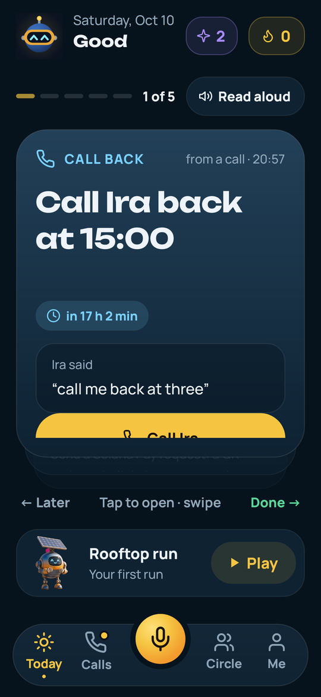
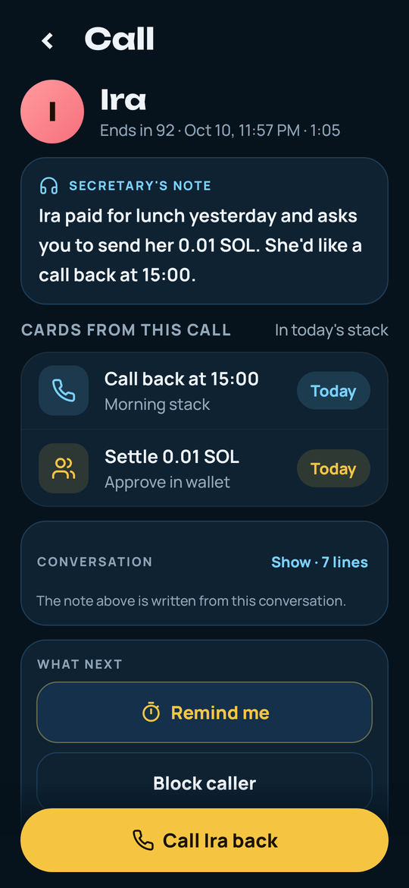
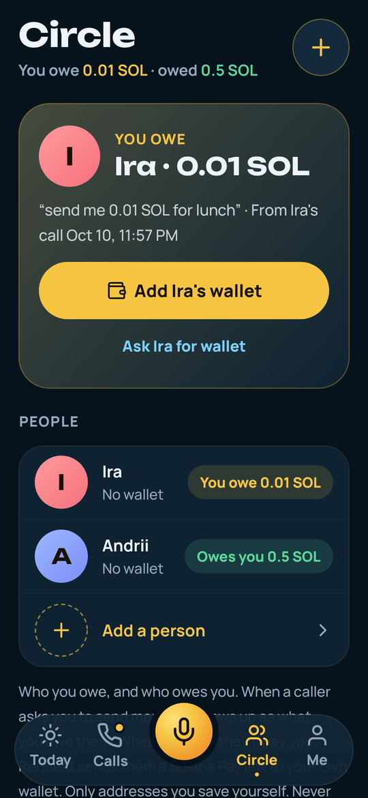
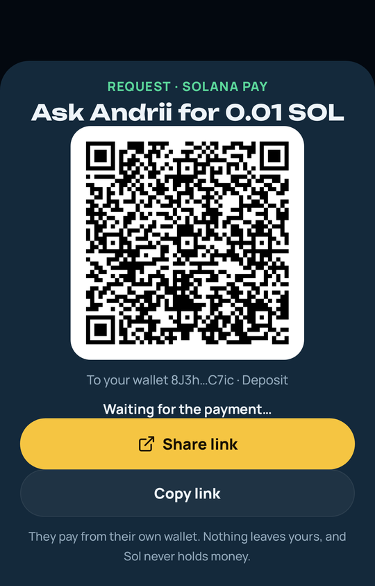
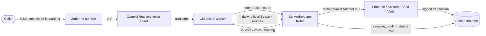

# Sol: AI secretary for Seeker

**Sol answers the calls you miss, and every morning one swipe clears what came out of them: call back, remind, or pay on Solana.**

I'm Vadym Bilobrovets, a solo founder from Ukraine. I miss calls in meetings, and some of those calls are people asking to be paid back. So I built Sol: an Android app with an AI secretary that picks up on a real phone line, writes me a short note, and turns the call into cards I clear in the morning. When a card is a payment, it's one tap and one approval in my own wallet, on Solana mainnet.

Built for the [Colosseum](https://www.colosseum.org/) hackathon (and the Solana Mobile CLOCK IN daily-habit track).

| Morning stack | Note from a call | Circle | Request by QR / SMS |
| --- | --- | --- | --- |
|  |  |  |  |

Videos: [tech demo](TECH_VIDEO_URL) · [pitch](PITCH_VIDEO_URL)

## Try it

1. On an Android phone (8.0 or newer), download `solarchik-assistant.apk` from the [latest release](https://github.com/Solar-DePIN-Hub/solarchik-assistant/releases/latest) ([direct link](https://github.com/Solar-DePIN-Hub/solarchik-assistant/releases/latest/download/solarchik-assistant.apk)) and allow the install when Android asks.
2. Open it. A short first-run guide explains the four parts below.
3. Call the shared demo secretary line, **+380 91 481 0885**, say who you are and what you want, and hang up. A note and cards show up in the app.
4. To pay or request money, connect Phantom or Solflare (Seed Vault on a Seeker). This is mainnet, so use tiny amounts.

The APK is signed with my own release key, not a store key. Package: `net.solardepin.solarchik.assistant`.

## What it does

- **Calls.** When I can't pick up, my carrier forwards the call (standard GSM conditional forwarding) to a Zadarma number. The call goes over SIP to an OpenAI Realtime voice agent that talks to the caller like a receptionist. My Cloudflare Worker saves the transcript, writes a short note (who, why, how urgent) and pulls out action cards: call back, reminder, or payment. The Calls tab keeps the history.
- **Today: the morning stack.** All of the day's cards in one stack: from calls, today's Seeker Season tasks, Circle debts and my habits. Each card says what it is and where it came from ("Call Ira back at 15:00, asked at 13:32"). Swipe right when it's done. Swipe left for Later (back to the end of today's stack), Tomorrow or Dismiss. Tapping a card does the action: opens the dialer, the payment, or the Season post. When every card is handled, I clock in and the streak grows. Signing a CLOCK IN memo on mainnet is optional.
- **Circle.** People I save myself, with their wallet address. Every person has **Send** and **Request**. Request makes a Solana Pay link and QR and opens an SMS ("Hi Ira, here's my payment link for 0.01 SOL"). Each link carries a one-off Solana Pay reference key, so when the money lands the app finds that transaction on chain (read-only) and shows **Paid ✓**. If a caller says "send me 0.01 SOL for lunch", the call adds that debt to Circle, linked to the call.
- **Me.** Wallet with SOL / USDC / SKR balances, **Send** and **Receive** (QR with my address, or request an exact amount). Daily habits I pick myself, including an optional "Save 1 USDC". Settings and wallet diagnostics.
- **Sol.** The mic button in the middle. Hold it and ask "who do I owe?" or "send Ira what I owe". Sol answers from my own data and opens the right card. He never sends anything by himself.
- **Season agent.** Every day the worker reads Solana Mobile's official sources (blog and docs) plus a dated, hand-checked list of partner drops announced on X, and puts today's Seeker Season tasks into the stack. Each task opens the original announcement. It doesn't claim, farm or sign anything.
- **Verified Seeker.** Sign In With Solana plus a Seeker Genesis Token check (Token-2022) on the server. It gives a badge and 10 extra secretary minutes a day. Everything else works without a Seeker.
- A small rooftop runner tile, left over from my first CLOCK IN build. It's a break, not the product.

## How it works



- The Android app is native Kotlin, no WebView. It holds no API keys; every model call goes through the worker.
- Worker source: [worker/solarchik-screen.js](worker/solarchik-screen.js) (calls, SIP, notes, Sol), [worker/assistant-extras.js](worker/assistant-extras.js) (call actions, briefing), [worker/season-drops.js](worker/season-drops.js) and [worker/season-rules.js](worker/season-rules.js) (Season), [worker/seeker-verify.js](worker/seeker-verify.js) (Genesis Token).
- AI phone minutes are capped per call (3 min), per account and per day, so a stuck call can't run up a bill.

## On-chain proof

Two real payments made from the app on my tablet on 10 Oct 2026, 0.01 SOL each from my wallet to Ira's, through Circle → Send → Phantom. Each one settled in about 3–4 seconds, with a fee of 0.00008 SOL.

| What | From → To | Amount | Slot | Transaction |
| --- | --- | --- | --- | --- |
| Circle payment #1 | `8J3h…C67ic` → `5sH2…7peL` | 0.01 SOL | 455365483 | [4z8PUAVD…ByLUnW6z](https://solscan.io/tx/4z8PUAVD99bFWRM2KHpAGFqarESNDxQBsKNVzsh3e2MCT65N79tgSKayRvfRSVZg8AMhJVnkA7ftUd22ByLUnW6z) |
| Circle payment #2 | `8J3h…C67ic` → `5sH2…7peL` | 0.01 SOL | 455400077 | [3BtXnkEf…F8bvdFFQbVTr](https://solscan.io/tx/3BtXnkEfWTbZbGSzEKFJVsrMTRYqBvGY39xMSd1gzdAEvWCBwFBLE13cYmqRug5xzgeA8Fv2XsDyF8bvdFFQbVTr) |

Wallets: [sender](https://solscan.io/account/8J3hxf1XSYV1HKVUJtwtQtVwSvSeaAyW5RmL8EqC67ic), [recipient](https://solscan.io/account/5sH2TB1x5gjYz9ReBfx9DjTjVX1kieYY41zCKjU47peL).

## Security

- **Nothing moves without my approval.** Every transaction is signed in the wallet app over Mobile Wallet Adapter. The app never sees a private key, and the server never holds one.
- **Simulated first.** Before the wallet opens, the app simulates the transaction on mainnet. If Solana would refuse it (not enough SOL, a new recipient below the rent minimum, no USDC), I get a plain reason instead of a failed signature.
- **No addresses from calls.** A payment only goes to an address I saved myself in Circle. If a caller dictates an address, the app shows a scam warning and ignores it.
- **App identity.** The wallet sees the app as `app.solardepin.net`, which serves a Digital Asset Links file for this package and signing certificate.
- **No secrets in the repo.** The keystore and its passwords live outside git (`keystore.properties` / environment variables). Worker keys are Cloudflare secrets.
- This is a hackathon build by one person, and it hasn't been audited. Start with tiny amounts.

## Business

- **Free:** Sol, the wallet, Circle, habits, and secretary minutes on the shared demo line.
- **Pro, $7.99 a month (proposed):** my own secretary number, more minutes, cards from every call.
- **Business (planned):** for small service businesses that miss calls while they work (barbers, repair shops, freelancers): own number, booking from the call, deposit requests.
- **A small fee on Circle payments** (planned, not in the app yet).

Go-to-market: Seeker owners first, because they already have a wallet on the phone; then small businesses.

Traction, honestly: it's live on mainnet and tested by 4 people, my family and friends. Nothing is billed yet.

## Roadmap

- Personal secretary numbers and Pro billing (USDC / SKR).
- Publish to the Solana dApp Store with a store key.
- Business plan pilot: booking and deposits from the call card.
- Test Seed Vault and the Genesis Token check on a real Seeker (I don't own one yet; I test on an Android tablet with Phantom).
- An external security review.

## Build from source

You need JDK 17 and the Android SDK (API 35). The Gradle wrapper (8.9) is in the repo.

```bash
cd artifacts/solarchik-handoff/android
echo "sdk.dir=$ANDROID_HOME" > local.properties   # if it isn't set already
./gradlew :app:testDebugUnitTest                   # unit + Robolectric tests
./gradlew :app:assembleDebug
```

Build output goes to `/tmp/solarchik-apk-build` by default (pass `-PbuildRoot=<dir>` to change it), so the APK is at `/tmp/solarchik-apk-build/outputs/apk/debug/app-debug.apk`. `assembleRelease` builds an unsigned APK unless `app/solarchik-release.jks` and its passwords (`keystore.properties` or `SOLARCHIK_STORE_PASSWORD` / `SOLARCHIK_KEY_PASSWORD`) are present.

The worker deploys with Wrangler; see [worker/DEPLOY.md](worker/DEPLOY.md).

## Links

- Pitch: [PITCH.md](PITCH.md) · Privacy: [PRIVACY.md](PRIVACY.md)
- Releases: https://github.com/Solar-DePIN-Hub/solarchik-assistant/releases
- My first CLOCK IN build (the game version, unchanged): https://github.com/Solar-DePIN-Hub/Solarchik
- X: [@SolarDePin](https://x.com/SolarDePin) · team.solardepinhub@gmail.com

## License

MIT, see [LICENSE](LICENSE).
