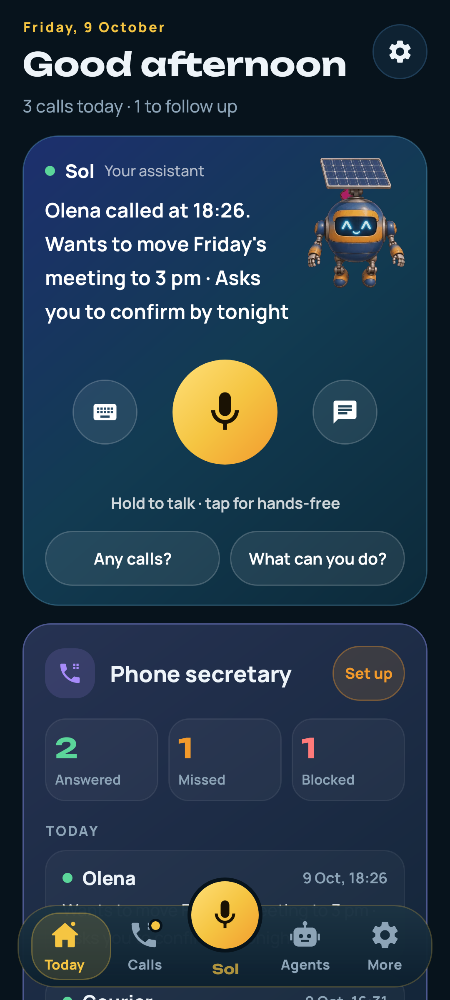
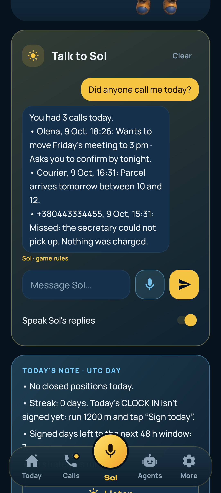
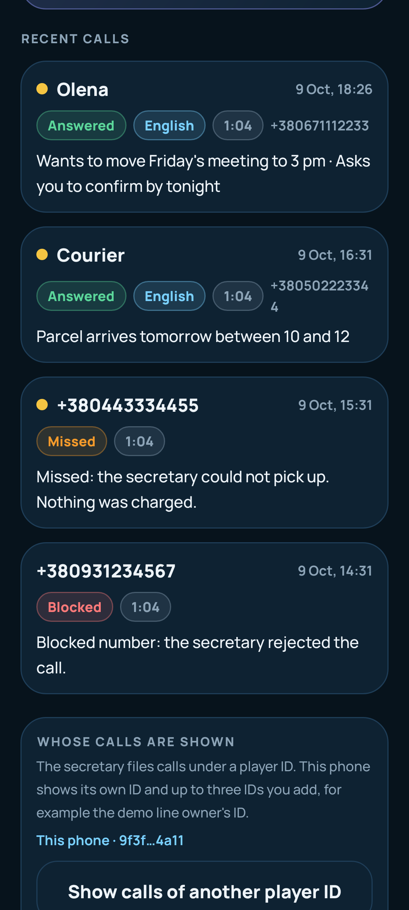
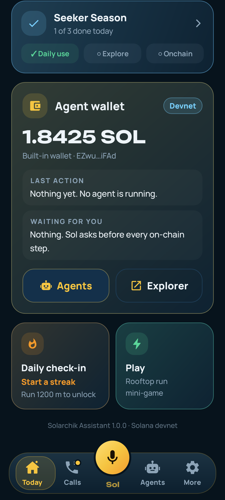
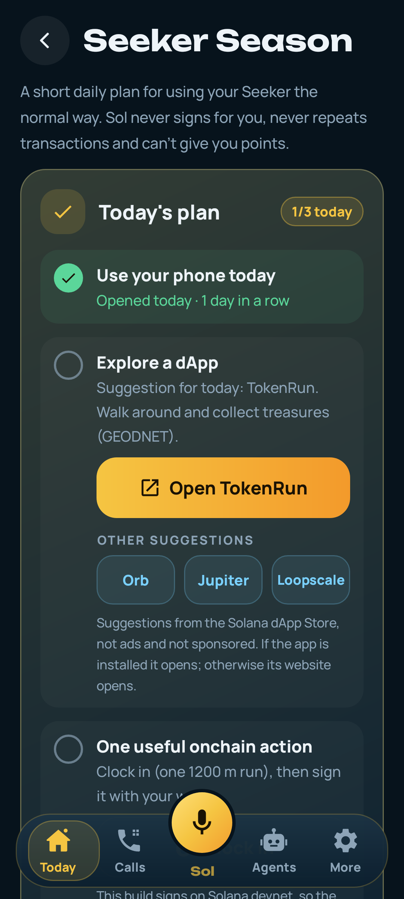
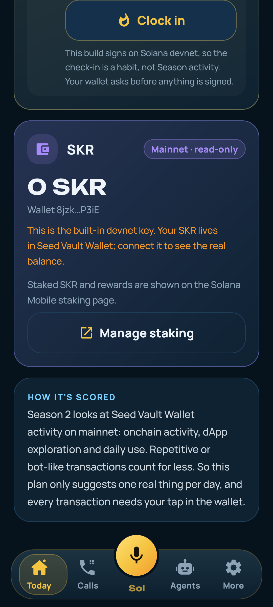

# Solarchik Assistant

Українською: [README.uk.md](README.uk.md).

I'm Vadym, and I build Solarchik on my own under Solar DePIN. Solarchik Assistant is an Android app that sits on my home screen and helps with the boring parts of the day. You hold one button and talk to Sol. An AI secretary answers calls I can't take and leaves a short note. An agent wallet on Solana devnet does on-chain steps only after I tap confirm.

I built this repo for the Colosseum Crypto World's Fair (Solana track, AI / agents). Submissions close 12 Oct 2026, 11:59pm PT (13 Oct, 09:59 Kyiv). My older game build, CLOCK IN, lives in [Solar-DePIN-Hub/Solarchik](https://github.com/Solar-DePIN-Hub/Solarchik), and I didn't change it for this. In this app the game is only a small "Play" tile.

**Download:** [solarchik-assistant.apk](https://github.com/Solar-DePIN-Hub/solarchik-assistant/releases/download/v1.0.0/solarchik-assistant.apk) (v1.0.0, Android 8+, sha256 `de3b730eeb31cb02f33bdfca00520f8d6cccb067e6932d7303288410b637288f`)

| Today | Sol answers from the phone | Call inbox |
| --- | --- | --- |
|  |  |  |
| **Agent wallet + Season card** | **Seeker Season plan** | **SKR (read-only) + staking link** |
|  |  |  |

Also in the folder: the first-launch screen (`docs/screens/00-onboarding.png`) and Today in Ukrainian (`docs/screens/01-today-uk.png`).

The screenshots are renders of the real app views from the Robolectric tests, not mockups. The calls in them are sample data with made-up numbers. The 1.8425 SOL balance is a value I set in the test, so the render doesn't depend on the network.

## Why I built it

I get a lot of calls from numbers I don't know, and most AI apps I tried were just another chat tab. What I wanted was one helper on the phone that picks up for me, tells me who called and what they wanted, and reminds me to call back. It should also be able to do something on Solana for me, but only after I say yes.

## What it does

- **Today (home).** It greets you and shows Sol with a big hold-to-talk mic. You can hold it to talk, tap it to go hands-free, or type. Under it you get today's calls with AI summaries, follow-ups from those calls, the agent wallet, the Seeker Season card, a daily check-in and a small Play tile.
- **Sol.** He's a voice assistant that answers in your phone's language (English or Ukrainian). Questions like "did anyone call me today?", "what can you do?" and "what should I do for Seeker Season today?" are answered on the phone from local data, so they work offline and right away. Other questions go to the AI. When Sol suggests an on-chain step, you get a confirmation card first.
- **Phone secretary.** A real phone line answers calls. The AI talks to the caller and then writes a short note: who called, why, how urgent it is, and a callback number. The app has an inbox, transcripts, reminders and a block list. "Try a call" dials the demo line, so you can hear it yourself.
- **Follow-ups.** Callbacks and reminders come from the call notes. You tick them off on Today.
- **Agent wallet (Solana devnet).** It works with Mobile Wallet Adapter (Phantom, Solflare, Seed Vault) or a built-in devnet wallet kept in Android Keystore, for people who don't have a wallet app. It shows your balance, what the agent did last, and what is waiting for your confirmation. You can mint strategy agent NFTs (Metaplex Core) and change their strategy.
- **Seeker Season helper.** This is a daily plan for Solana Mobile's Seeker Season 2, with three items:
  - Use your phone today. This keeps a streak.
  - Open one suggested dApp from the dApp Store.
  - Sign the daily check-in.

  The screen also shows your SKR balance and links to the official staking page. More details are in the section below.
- **Daily check-in.** A memo transaction on devnet that you sign yourself. It needs one short run first, which is where the old game comes in.
- **Play.** The rooftop runner from CLOCK IN, kept only as a small bonus.
- **Onboarding.** Three short screens on first launch. Everything in the app is in English and Ukrainian.

## Seeker Season helper (what it is and isn't)

Seeker Season 2 scores Seed Vault Wallet activity on mainnet: on-chain activity, dApp exploration and daily use. Since 20 Aug 2026, repetitive or bot-like transactions count for less. So I didn't build a farming tool. I built a small daily nudge to use the phone in a normal way.

- **Plan items tick only from real state on this phone.**
  - "Daily use" ticks when you opened the app today.
  - "Explore" ticks when you opened a suggested dApp from the plan today.
  - "On-chain action" ticks when today's check-in is signed.
- **The dApps are suggestions, not ads.** I checked that they're in the dApp Store catalog: Orb by Helius (`dev.helius.orb`), Jupiter Mobile (`ag.jup.jupiter.android`), Loopscale (`com.loopscale.app`) and TokenRun by GEODNET (`com.tokenrun.app`). The plan suggests one per day, in rotation. If the app is installed it opens; otherwise its website opens. Nobody paid for a spot.
- **SKR is read-only, on mainnet.** The app calls `getTokenAccountsByOwner` on the public mainnet RPC for the connected address, with mint `SKRbvo6Gf7GondiT3BbTfuRDPqLWei4j2Qy2NPGZhW3`, and adds up the balances. It never signs anything to do this. If the RPC fails, you see "—" and a retry button.
- **Staking is a link.** I couldn't confirm the staking program's account layout well enough to read staked SKR and rewards myself, so I don't show numbers I can't stand behind. The card says staking info is on [stake.solanamobile.com](https://stake.solanamobile.com) and has a "Manage staking" button.
- **Nothing gets automated.** There is no auto-signing, no repeated transactions and no fake points. This build signs on devnet, so the check-in keeps your habit but doesn't count as Season activity. The screen says that too.
- **Sol can read the plan out loud.** Ask "what should I do for Seeker Season today?"

## Architecture

```
Android app (Kotlin, no WebView)
 ├─ wallet: Mobile Wallet Adapter 2.0 (Phantom / Solflare / Seed Vault)
 │          or built-in devnet key (Android Keystore)
 │          └─> Solana devnet: check-in memo, Metaplex Core agent NFTs, strategy changes, fees
 ├─ SKR balance (read-only) ──> Solana mainnet public RPC (getTokenAccountsByOwner)
 ├─ Sol chat / voice ──> Cloudflare Worker "solarchik-screen"
 │                        /sol/chat  OpenAI gpt-4.1-mini (streamed, can propose one action)
 │                        /sol/tts   OpenAI gpt-4o-mini-tts
 │                       fallback: solarchik-market.vercel.app (Gemini)
 ├─ daily note retell ──> friend.solardepin.net (Featherless)
 ├─ calls inbox / block / claim ──> same Cloudflare Worker (/inbox, /call, /block, /call-claim)
 └─ faucet for the built-in wallet ──> server faucet drip (devnet)

Phone secretary: caller ──> Zadarma number ──SIP──> OpenAI Realtime (voice agent)
                 ──> worker saves transcript + AI summary ──> app inbox, reminders, notifications
```

The app holds no API keys. All model calls go through the worker. The worker source is public in the game repo ([worker/solarchik-screen.js](https://github.com/Solar-DePIN-Hub/Solarchik/blob/web-fees/worker/solarchik-screen.js)).

## Devnet proof

I checked every signature below with `getSignatureStatuses` on devnet (9 Oct 2026). All of them are finalized.

- Built-in wallet run (the app's own code path): wallet [`C9pVXx7i…GuWnz`](https://explorer.solana.com/address/C9pVXx7ieotYjaQr76gAgx7bmA67hZQivFTZ2UxGuWnz?cluster=devnet)
  - [faucet drip](https://explorer.solana.com/tx/Wh56r93JhEc18BDrHNUEvmfmpPZoFdsgsxv4GVHkzUExLGXtzxxiP1zNLAjh4GEjHNa2kNnJrpyxLvXCcbhFZ6o?cluster=devnet)
  - [free agent mint](https://explorer.solana.com/tx/598nnYPz51jNodmtsphSozdnT4DfQRyMupdDWiapkqYU6beEMnhXyZba29QFZaWTB5pApmLXvyEFY5NDidXS6edJ?cluster=devnet)
  - [Pro buy](https://explorer.solana.com/tx/b2PztsNSiaUixeFxtfPsoFrAKzfgSU3kRDi1vDXBHVh41RaiXDKPVzV1MLtVxp8X5sm1NAMDHgmfJFR1tzCMqAJ?cluster=devnet)
- Agent collection: [`74Tyscw6…euQC`](https://explorer.solana.com/address/74Tyscw6gL9mDxvNsSSDuj6v4YHqFPCyUULirjLPeuQC?cluster=devnet)
  - [co-signed mint](https://explorer.solana.com/tx/3iToTdZKs6rEnbYF8nvhDwNaNgNVemHp4Zs7GwrABRn2xM6jVa8YKXYREjb4C1mCBG6Pfy1MZmyY3cGrH96dEhP3?cluster=devnet)
  - [strategy change with the 240 h sale lock](https://explorer.solana.com/tx/FU9HaQSHsQqU9x2s9T7HogELLk3b51i2jMdfkLFhHLzbqnEiZb6LGdt3NT6tN55HLBbqskNDyJsh65JpqwgY7p6?cluster=devnet)
  - [transfer refused on chain while locked](https://explorer.solana.com/tx/2kUUn4L8rNN6ntfEvMawocHDqsrysdSdEhoxYbuugZuSH3wnUw1rz8Zjgdqhg9HaouA3ghvw7g5MhMJfeHTxN9if?cluster=devnet) (this one is expected to fail, with mpl-core error 0x9)
  - [results write](https://explorer.solana.com/tx/3JZbHzWkShuR54dc46frsas2zrBK6vSNPGuxwYaWoDHoZTGttkKGTghUpm8UjxxEEoR4Sk8zzwivPTh5GjwbjTqH?cluster=devnet)
  - [market buy with a 5 % royalty](https://explorer.solana.com/tx/4cJkFGAC7UqKWwxCcKGnpFVgcmkXsB41zwvXp5FEwMFER7n5zsuDEvx2wZyiDYSEXhMhS2zAW9ULUxNppL9oiSc9?cluster=devnet)
- The full run, with every step: [docs/devnet-strategy-run.md](docs/devnet-strategy-run.md)

## Install

1. On an Android phone (8.0 or newer), download [solarchik-assistant.apk](https://github.com/Solar-DePIN-Hub/solarchik-assistant/releases/download/v1.0.0/solarchik-assistant.apk) from the [v1.0.0 release](https://github.com/Solar-DePIN-Hub/solarchik-assistant/releases/tag/v1.0.0).
2. Allow installs from your browser or file manager when Android asks.
3. Open the app. It installs as **Solarchik Assistant** (`net.solardepin.solarchik.assistant`), next to the CLOCK IN game if you have it.
4. To try the wallet without a wallet app, tap "Set up wallet" on Today. You get the built-in devnet wallet, and the faucet funds it. If Phantom, Solflare or Seed Vault is installed, it connects through MWA instead.
5. To hear the secretary, tap "Try a call" on Today. It dials the demo line, +380 91 481 0885.

The APK is signed with my test release key. That's the same key setup I used for the CLOCK IN builds, not a Play Store key.

Build from source:

```bash
cd artifacts/solarchik-handoff/android
./gradlew :app:testDebugUnitTest      # 370 tests, 11 skipped (device/network-only)
./gradlew :app:assembleDebug
```

## What's real and what's simulated

| Part | Status |
| --- | --- |
| Sol chat and voice | Real. The model runs through my Cloudflare Worker. Call questions, "what can you do" and the Season plan are answered on the phone. |
| Phone secretary | Real. A real number, the Zadarma SIP line and OpenAI Realtime, with real transcripts and summaries. It's one demo line, which I share. |
| Wallet and on-chain steps | Real transactions, on **devnet only**. This build is locked to devnet (`DEVNET_ONLY`). There's no mainnet signing at all. |
| Agent "trading" | **Simulated.** It's paper trading on live public prices. Agents never send exchange orders, and the results written on chain come from that paper ledger. |
| SKR balance | Real, read-only mainnet data. |
| Staked SKR and rewards | Not shown. There's a link to stake.solanamobile.com instead. |
| Seeker Season plan | Real local state on the phone. It doesn't know or show your Season points; only Solana Mobile has those. |
| Screenshots in this README | Real app views rendered in tests, with sample calls and a sample balance. |

Some known rough edges:
- When a question goes to the model, Sol's persona on the worker still sometimes talks like the game character. I left the live worker alone for this build.
- I tested on the Robolectric renders and the unit tests. I didn't have an emulator for this release. The full secretary flow and the voice need a real phone.

## Roadmap

- Move the worker persona fully to "assistant".
- Let the secretary turn reminders into calendar events.
- Publish to the Solana dApp Store.
- An optional mainnet build, where every signature still goes through Seed Vault / MWA with an explicit tap.
- Real staking numbers for SKR, once I can read the staking accounts reliably.
- Your own secretary number, instead of the shared demo line.

## Links

| Item | URL |
| --- | --- |
| This repo | https://github.com/Solar-DePIN-Hub/solarchik-assistant |
| Release v1.0.0 | https://github.com/Solar-DePIN-Hub/solarchik-assistant/releases/tag/v1.0.0 |
| Game repo (CLOCK IN, unchanged) | https://github.com/Solar-DePIN-Hub/Solarchik |
| API / market (devnet) | https://solarchik-market.vercel.app |
| Demo video (CLOCK IN cut, an Assistant cut is coming) | https://youtu.be/oAxoliLwUXo |
| Pitch | [PITCH.md](PITCH.md) |
| Privacy | [PRIVACY.md](PRIVACY.md) |
| Build notes | [artifacts/solarchik-handoff/NATIVE_PROGRESS.md](artifacts/solarchik-handoff/NATIVE_PROGRESS.md) |

## Timeline

I started Solarchik on 19 Sep 2026. An older Telegram prototype I made in July is unrelated and isn't part of this. Before this, I used the game-shaped build for MunichTech (Sep 2026) and CLOCK IN / Radiants (Oct 2026). This repo is the assistant version for Colosseum.

## Contact

Vadym Bilobrovets, Solar DePIN (solo). team.solardepinhub@gmail.com · X [@SolarDePin](https://x.com/SolarDePin)
