# Solarchik Assistant

Українською: [README.uk.md](README.uk.md).

I'm Vadym, and I build Solarchik on my own under Solar DePIN. Solarchik Assistant is an Android app that sits on my home screen and helps with the boring parts of the day. You hold one button and talk to Sol. An AI secretary answers calls I can't take and leaves a short note. Since 1.1.0 it runs on **Solana mainnet** with my own wallet (Mobile Wallet Adapter), and every transaction is approved in the wallet app. Three small agents help with Seeker Season, saving and watching prices. Every morning Sol reads me a short spoken briefing. Requests from calls become action cards.

I built this repo for the Colosseum Crypto World's Fair (Solana track, AI / agents). Submissions close 12 Oct 2026, 11:59pm PT (13 Oct, 09:59 Kyiv). My older game build, CLOCK IN, lives in [Solar-DePIN-Hub/Solarchik](https://github.com/Solar-DePIN-Hub/Solarchik), and I didn't change it for this. In this app the game is only a small "Play" tile.

**Download:** [solarchik-assistant.apk](https://github.com/Solar-DePIN-Hub/solarchik-assistant/releases/download/v1.2.4/solarchik-assistant.apk) (v1.2.4, Android 8+, sha256 `f2b6395245d2cdb2e47108092adbfbc871fc966183b98916a4ba0ef9da9b705a`)

**New in 1.2.4:** **Circle**, a call-driven list of who you owe (More → Circle). When a caller asks you to send money ("send me 0.01 SOL for lunch"), it shows up as "You owe Ira 0.01 SOL" with a link to the call. Settle sends it to an address you saved yourself (matched by phone, then name), with one confirm in the app and the approval in your wallet. Once it's confirmed on chain, the debt shows as settled with a Solscan link, and the secretary can tell Ira it was already sent. With no address yet, you get Add Ira's wallet (prefilled name and phone; paste an address or a solana: link) or Ask Ira for wallet (a share message). Sol answers "who do I owe?" and "send Ira what I owe" from the list, and the morning briefing says "You owe Ira 0.01 SOL from yesterday's call." An address heard on a call is never used. Also: wallet connect asks again for approval when the wallet refuses a saved token; the Today balance matches Settings; duplicate call-back cards are cleaned up; old-language card text is hidden; the diagnostics log is shorter. Only "you owe" debts exist for now (no "owes you"), there is no QR scan yet (paste works), and Circle is not yet tested on a device.

**New in 1.2.1** (full-app audit): every screen rendered in English and Ukrainian (no Cyrillic in English; Ukrainian buttons that were cut off now fit), every button checked for a working handler, a "Partner perks today" line on Today's Season card, long Sol replies split so the voice never stops at 400 characters, the empty Send button focuses the text field, the forwarding-number field no longer squeezed out by "Save", honest privacy copy on the Sol tab. Worker: blog dates read from the page markup, Ukrainian notes say the callback number in Ukrainian, the briefing doesn't read phone numbers aloud.

**New in 1.2.0** (the server side is live; the app parts still need a check on a device):
- **Wallet:** Settings → Wallet diagnostics logs every Mobile Wallet Adapter step (wallet found, intent, session, authorize) and copies/shares the log; pick Phantom or Solflare explicitly; longer wait for a slow wallet; cleartext allowed only to 127.0.0.1/localhost (MWA's local WebSocket). Phantom connect on my tablet is **not yet confirmed**.
- **SKR:** a call like "send me 50 SKR" becomes a "Pay 50 SKR" card; you type or paste the recipient (never taken from the call), the app builds an SPL transfer (creates the recipient's SKR account if missing, 6 decimals checked on mainnet) and your wallet signs it. SKR balance on Today and in the briefing, a Stake SKR link to stake.solanamobile.com (no yield numbers), Watcher SKR price alerts, and Sol answers "what is my SKR balance".
- **Season tasks:** today's Seeker Season partner drops with the perk as announced and its source link. Reads the official Solana Mobile blog and docs. X support is built in and turns on with the paid API. Drops announced on X are a hand-checked, dated list (curated 2026-10-10). No points promises.
- **Verified Seeker:** Sign In With Solana + Seeker Genesis Token check on the server (Token-2022, non-zero balance, SGT metadata + group; one token = one account) gives a Verified badge and +10 secretary minutes a day. Without a Seeker everything works the same. Not tested on a real Seeker (I don't have one); the server check is tested against a real holder's on-chain data.

> **Mainnet, real funds.** Since 1.1.0 the app talks to Solana mainnet. Anything you approve in your wallet moves real SOL or tokens and can't be undone. The app never signs for your wallet by itself. Real swaps, the Saver and the experimental delegated limit are all off until you turn them on, and they have small caps. Read [What's real on mainnet](#whats-real-on-mainnet-and-what-isnt) first.

| Today | Sol answers | Call inbox |
| --- | --- | --- |
| 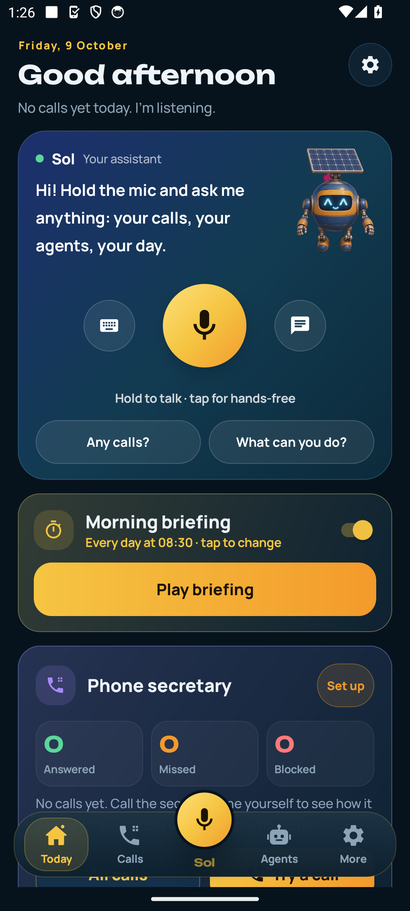 | 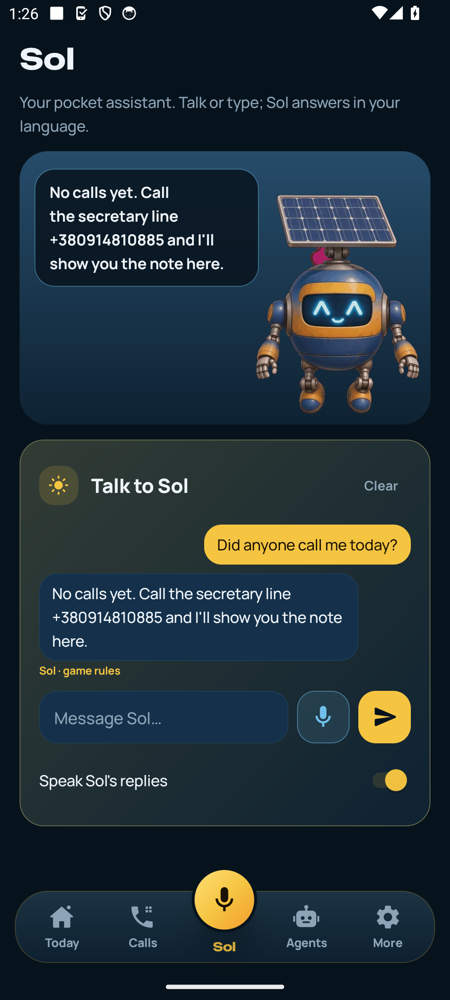 | 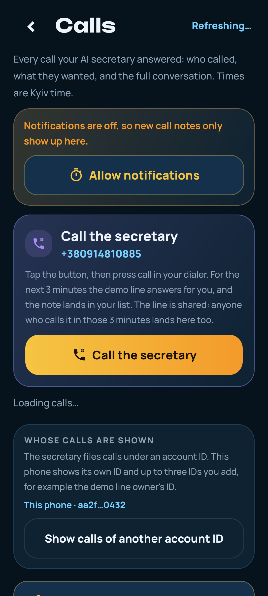 |
| **Three agents** | **Seeker Season plan (one-tap check-in)** | **Official Season rules watcher** |
| 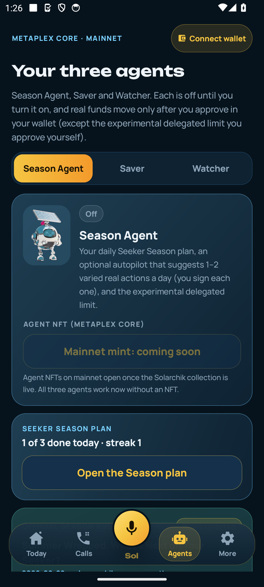 | 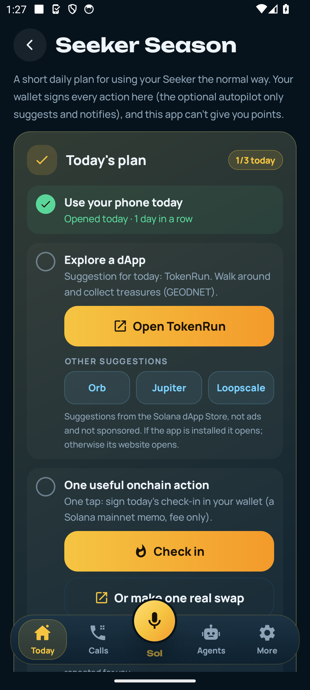 | 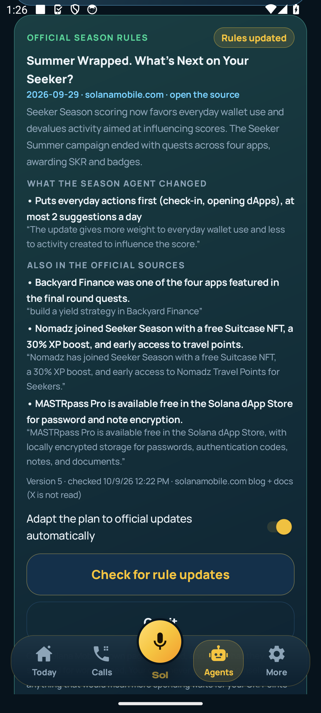 |

| **Season Agent** | **Morning briefing** | **Actions from calls** |
| 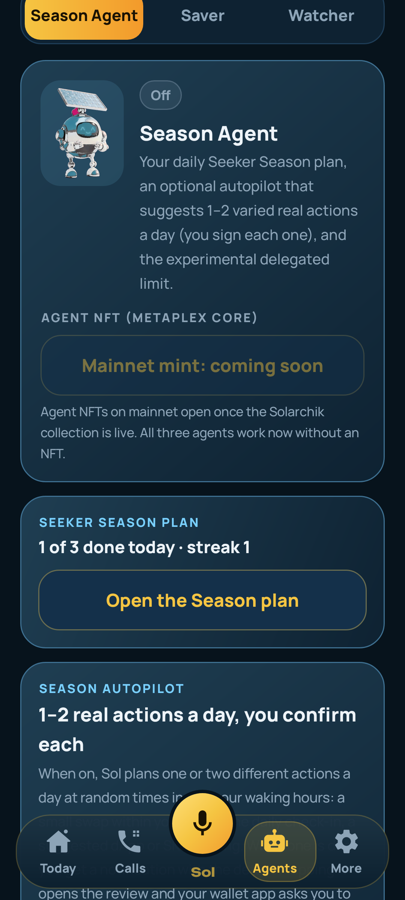 | 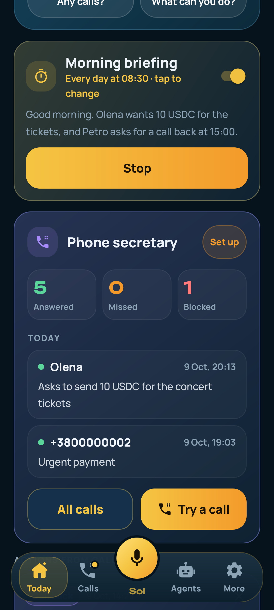 | 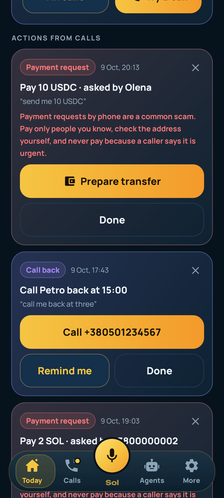 |
| **Saver** | **Watcher** | **Payment from a call: scam warning** |
| 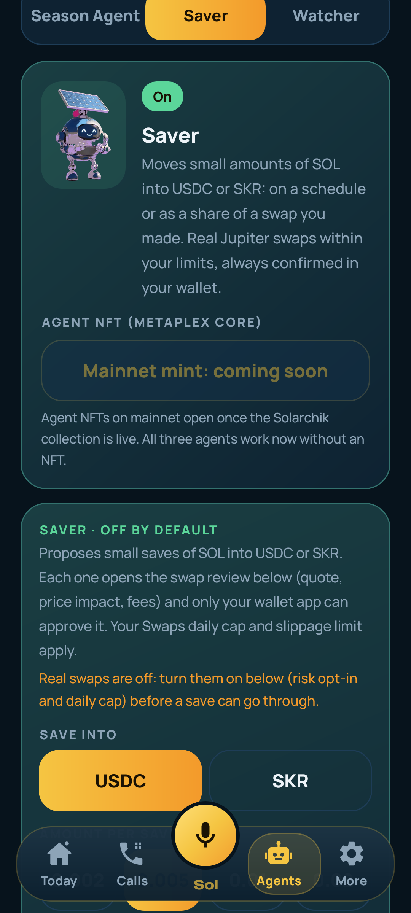 | 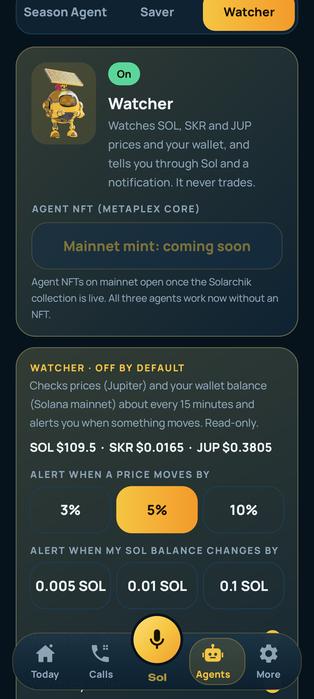 | 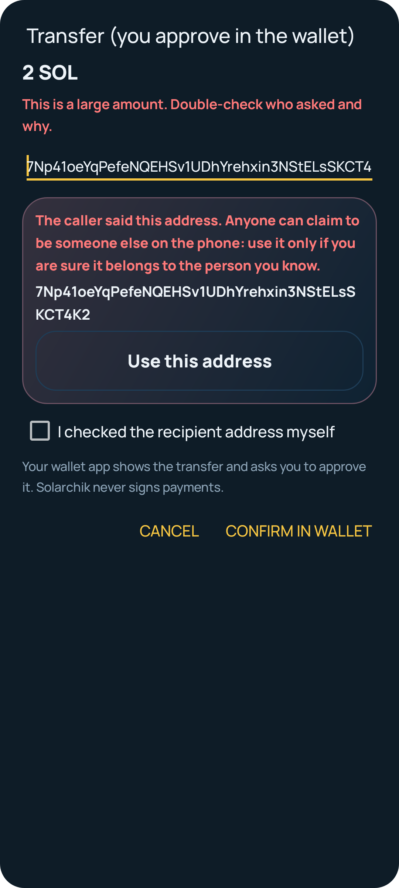 |

The first table is from Firebase Test Lab (robo crawl of the v1.1.1 release APK on a MediumPhone, Android 14), except the Calls inbox; that one and the second table are Robolectric renders of the real app views. More: [docs/screens/1.1.x](docs/screens/1.1.x) (onboarding, Ukrainian Settings and Calls, tablet), [docs/screens/1.1.0](docs/screens/1.1.0) and [docs/evidence/1.1.0.md](docs/evidence/1.1.0.md).

None of the screenshots are mockups. The calls in the Robolectric renders are sample data with made-up numbers.

## Why I built it

I get a lot of calls from numbers I don't know, and most AI apps I tried were just another chat tab. What I wanted was one helper on the phone that picks up for me, tells me who called and what they wanted, and reminds me to call back. It should also be able to do something on Solana for me, but only after I say yes.

## What it does

- **Today (home).** It greets you and shows Sol with a big hold-to-talk mic. You can hold it to talk, tap it to go hands-free, or type. Under it you get the morning briefing, action cards from calls, today's calls with AI summaries, follow-ups, your mainnet wallet, the Seeker Season card, a daily check-in and a small Play tile.
- **Sol.** He's a voice assistant that answers in your phone's language (English or Ukrainian). Questions like "did anyone call me today?", "what can you do?" and "what should I do for Seeker Season today?" are answered on the phone from local data, so they work offline and right away. Other questions go to the AI. When Sol suggests an on-chain step, you get a confirmation card first.
- **Phone secretary.** A real phone line answers calls. The AI talks to the caller and then writes a short note: who called, why, how urgent it is, and a callback number. The app has an inbox, transcripts, reminders and a block list. "Try a call" dials the demo line, so you can hear it yourself. One AI call lasts at most 3 minutes: at 2:45 the secretary says it will pass the message on and says goodbye, and the line hangs up at 3:00. The line also answers at most 30 AI minutes a day in total (20 per account); after that a caller hears a short "please call back tomorrow" and nothing is charged.
- **Follow-ups.** Callbacks and reminders come from the call notes. You tick them off on Today.
- **Wallet (Solana mainnet).** Mobile Wallet Adapter only (Phantom, Solflare, Seed Vault). There is no hot wallet on mainnet: every transaction opens your wallet app and you approve or reject it there. Today shows your real SOL and SKR balances, with Solscan and Orb links for every signature.
- **Morning voice briefing.** At a time you pick (08:30 by default) you get a notification. Tapping it, or just opening Today, plays Sol's spoken summary: who called and what they wanted, callbacks, follow-ups that are due, how your mainnet wallet changed since yesterday and where your Season plan stands. It's built from the data on the phone; the worker only turns those facts into a few sentences, and offline a local template does it. There's also a "Play briefing" button.
- **Actions from calls.** After the secretary takes a call, the worker reads the note and pulls out what the caller asked for: a payment, a callback or a reminder. They show up as cards on Today and in the call details. A call can give up to three cards, and "remind her about the meeting on Monday" becomes a reminder for that Monday (09:00 if no time was said).
  - A **callback** is one tap to the phone dialer (you press call) plus an optional reminder.
  - A **reminder** becomes a local notification.
  - A **payment** becomes a prepared SOL or USDC transfer that you approve in your wallet. The recipient field starts empty. If the caller said an address, it's shown in full in a red card with a scam warning, and you have to tap "Use this address" and tick "I checked the address myself". Nothing is ever signed automatically.
- **Three agents** (Agents tab), all off by default:
  - **Season Agent.** The daily Season plan, an optional autopilot that sends you 1–2 varied, real actions a day as notifications (you tap, the wallet signs), and the experimental delegated limit (below).
    - **Official rules watcher.** Every 6 hours (and when you tap "Check for rule updates") the worker reads Solana Mobile's own blog (newest posts from the sitemap; there's no RSS) and the SKR docs, notices new or changed pages and pulls out "scoring signals": what counts more or less, campaigns with dates, featured dApps. Each one keeps the source link and a quote, and it's kept only if that quote really appears on the page. The Season Agent then adapts its plan by itself only in safe ways (the order of suggestions, fewer actions a day, featured dApps first). Anything that would mean more spending waits for your OK, and your caps never go up. X (@solanamobile) isn't read, because there's no free way to read it without logging in. A "Rules updated" card shows the source, a short summary and what changed.
  - **Saver.** Moves small amounts of SOL into USDC or SKR, either on a schedule or as a share (0–25 %) of the "change" from a swap you made. Each save is a real Jupiter swap that goes through the normal review (quote, price impact, fees) and your wallet. Your daily swap cap still applies.
  - **Watcher.** Watches SOL/SKR/JUP prices (Jupiter Price API) and your wallet balance and tells you when something moves past your threshold, as a notification and in Sol's context. It has no transaction code and never trades.
- **Real swaps (Jupiter).** Off until you accept the risk note. Only SOL, USDC, SKR and JUP. A daily cap (0.05 SOL by default, up to 0.5), a max slippage (0.5 % by default, up to 3 %) and a 1 % price-impact limit. You see the quote, the impact and the fees before the wallet opens. Paper mode is still there.
- **Experimental delegated limit.** Off by default, behind a red warning. You approve an SPL token allowance (for example 5 USDC) to an agent key on the phone, so it can do small swaps inside per-action and per-day caps until the allowance expires. You can top it up, change it, revoke it and withdraw at any time. Seeker Season may not count these as your activity.
- **Agent NFTs.** Each of the three agents has a Free and a Pro (0.1 SOL to the treasury) Metaplex Core NFT. On mainnet the button says "coming soon" until the collection exists. The agents work without an NFT.
- **Seeker Season helper.** This is a daily plan for Solana Mobile's Seeker Season 2, with three items:
  - Use your phone today. This keeps a streak.
  - Open one suggested dApp from the dApp Store.
  - Sign the daily check-in.

  The screen also shows your SKR balance and links to the official staking page. More details are in the section below.
- **Daily check-in.** One tap: a mainnet memo transaction that you sign yourself in the wallet (about 0.000005 SOL in fees). No run in Play is needed; the streak counts signed days.
- **Play.** The rooftop runner from CLOCK IN, kept only as a small bonus. The Play tile starts the run straight away and brings you back to Today when it ends.
- **Onboarding.** Three short screens on first launch.
- **Languages.** English by default. Ukrainian is complete too: More → Language → Українська (or "Phone" to follow the phone's language). Sol's chat, voice, the briefing and the call actions follow the same choice.

## Seeker Season helper (what it is and isn't)

Seeker Season 2 scores Seed Vault Wallet activity on mainnet: on-chain activity, dApp exploration and daily use. Since 20 Aug 2026, repetitive or bot-like transactions count for less. So I didn't build a farming tool. I built a small daily nudge to use the phone in a normal way.

- **Plan items tick only from real state on this phone.**
  - "Daily use" ticks when you opened the app today.
  - "Explore" ticks when you opened a suggested dApp from the plan today.
  - "On-chain action" ticks when today's check-in is signed.
- **The dApps are suggestions, not ads.** I checked that they're in the dApp Store catalog: Orb by Helius (`dev.helius.orb`), Jupiter Mobile (`ag.jup.jupiter.android`), Loopscale (`com.loopscale.app`) and TokenRun by GEODNET (`com.tokenrun.app`). The plan suggests one per day, in rotation. If the app is installed it opens; otherwise its website opens. Nobody paid for a spot.
- **SKR is read-only, on mainnet.** The app calls `getTokenAccountsByOwner` on the public mainnet RPC for the connected address, with mint `SKRbvo6Gf7GondiT3BbTfuRDPqLWei4j2Qy2NPGZhW3`, and adds up the balances. It never signs anything to do this. If the RPC fails, you see "—" and a retry button.
- **Staking is a link.** I couldn't confirm the staking program's account layout well enough to read staked SKR and rewards myself, so I don't show numbers I can't stand behind. The card says staking info is on [stake.solanamobile.com](https://stake.solanamobile.com) and has a "Manage staking" button.
- **Nothing is farmed.** There's no auto-signing of your wallet, no repeated transactions and no fake points. The plan counts only real actions on mainnet (check-in memo, swaps you approved, dApps you opened). This app can't give you points, and nothing here guarantees them.
- **Sol can read the plan out loud.** Ask "what should I do for Seeker Season today?"

## Architecture

```
Android app (Kotlin, no WebView)
 ├─ wallet: Mobile Wallet Adapter 2.0 (Phantom / Solflare / Seed Vault), approve in the wallet app
 │          └─> Solana mainnet-beta (public RPC, retries): check-in memo, Jupiter swaps, SOL/USDC
 │              transfers from call actions, SPL approve/revoke for the delegated limit
 │          (hidden developer switch: devnet, built-in devnet key in Android Keystore + faucet)
 ├─ Jupiter lite-api: swap quotes/transactions (v1), prices (Price API v3, read-only)
 ├─ SKR / SOL balances (read-only) ──> mainnet RPC
 ├─ Sol chat / voice ──> Cloudflare Worker "solarchik-screen"
 │                        /sol/chat      OpenAI gpt-4.1-mini (assistant persona)
 │                        /sol/briefing  morning briefing text from facts the phone sends
 │                        /call/actions  payment / callback / reminder extraction (structured output)
 │                        /season/rules  official Season scoring signals (cron every 6 h + /check)
 │                        /sol/tts       OpenAI gpt-4o-mini-tts
 │                        /agent/*       mainnet agent NFT mint config / co-sign / verify (not live yet)
 ├─ calls inbox / block / claim ──> same Cloudflare Worker (/inbox, /call, /block, /call-claim)
 └─ background (WorkManager): autopilot / Saver / Watcher tick every ~15 min, briefing at your time
Phone secretary: caller ──> Zadarma number ──SIP──> OpenAI Realtime (voice agent)
                 ──> worker saves transcript + AI summary ──> app inbox, reminders, notifications
```

The app holds no API keys. All model calls go through the worker. The worker source is in this repo: [worker/solarchik-screen.js](worker/solarchik-screen.js), [worker/assistant-extras.js](worker/assistant-extras.js), [worker/agent-mint.js](worker/agent-mint.js).

## Devnet proof (1.0.x)

These are from the devnet builds before 1.1.0. I checked every signature below with `getSignatureStatuses` on devnet (9 Oct 2026). All of them are finalized.

- Built-in wallet run (the app's own code path): wallet [`C9pVXx7i…GuWnz`](https://explorer.solana.com/address/C9pVXx7ieotYjaQr76gAgx7bmA67hZQivFTZ2UxGuWnz?cluster=devnet)
  - [faucet drip](https://explorer.solana.com/tx/Wh56r93JhEc18BDrHNUEvmfmpPZoFdsgsxv4GVHkzUExLGXtzxxiP1zNLAjh4GEjHNa2kNnJrpyxLvXCcbhFZ6o?cluster=devnet)
  - [free agent mint](https://explorer.solana.com/tx/598nnYPz51jNodmtsphSozdnT4DfQRyMupdDWiapkqYU6beEMnhXyZba29QFZaWTB5pApmLXvyEFY5NDidXS6edJ?cluster=devnet)
  - [Pro buy](https://explorer.solana.com/tx/b2PztsNSiaUixeFxtfPsoFrAKzfgSU3kRDi1vDXBHVh41RaiXDKPVzV1MLtVxp8X5sm1NAMDHgmfJFR1tzCMqAJ?cluster=devnet)
- Agent collection: [`74Tyscw6…euQC`](https://explorer.solana.com/address/74Tyscw6gL9mDxvNsSSDuj6v4YHqFPCyUULirjLPeuQC?cluster=devnet)
  - [co-signed mint](https://explorer.solana.com/tx/3iToTdZKs6rEnbYF8nvhDwNaNgNVemHp4Zs7GwrABRn2xM6jVa8YKXYREjb4C1mCBG6Pfy1MZmyY3cGrH96dEhP3?cluster=devnet)
  - [strategy change with the 240 h sale lock](https://explorer.solana.com/tx/FU9HaQSHsQqU9x2s9T7HogELLk3b51i2jMdfkLFhHLzbqnEiZb6LGdt3NT6tN55HLBbqskNDyJsh65JpqwgY7p6?cluster=devnet)
  - [transfer refused on chain while locked](https://explorer.solana.com/tx/2kUUn4L8rNN6ntfEvMawocHDqsrysdSdEhoxYbuugZuSH3wnUw1rz8Zjgdqhg9HaouA3ghvw7g5MhMJfeHTxN9if?cluster=devnet) (this one is expected to fail, with mpl-core error 0x9)
  - [results write](https://explorer.solana.com/tx/3JZbHzWkShuR54dc46frsas2zrBK6vSNPGuxwYaWoDHoZTGttkKGTghUpm8UjxxEEoR4Sk8zzwivPTh5GjwbjTqH?cluster=devnet)
  - [market buy with a 5 % royalty](https://explorer.solana.com/tx/4cJkFGAC7UqKWwxCcKGnpFVgcmkXsB41zwvXp5FEwMFER7n5zsuDEvx2wZyiDYSEXhMhS2zAW9ULUxNppL9oiSc9?cluster=devnet)
- The full run, with every step: [docs/devnet-strategy-run.md](docs/devnet-strategy-run.md)

## Install

1. On an Android phone (8.0 or newer), download [solarchik-assistant.apk](https://github.com/Solar-DePIN-Hub/solarchik-assistant/releases/download/v1.2.4/solarchik-assistant.apk) from the [latest release](https://github.com/Solar-DePIN-Hub/solarchik-assistant/releases/tag/v1.2.4).
2. Allow installs from your browser or file manager when Android asks.
3. Open the app. It installs as **Solarchik Assistant** (`net.solardepin.solarchik.assistant`), next to the CLOCK IN game if you have it.
4. To connect a wallet, tap "Set up wallet" on Today. You need Phantom, Solflare or Seed Vault; it's a mainnet wallet with real funds. Without a wallet app you can still use Sol, the secretary, the briefing and the Watcher's prices.
5. To hear the secretary, tap "Try a call" on Today. It dials the demo line, +380 91 481 0885.

The APK is signed with my test release key. That's the same key setup I used for the CLOCK IN builds, not a Play Store key.

Build from source:

```bash
cd artifacts/solarchik-handoff/android
./gradlew :app:testDebugUnitTest      # 422 tests, 18 skipped (device/network-only)
./gradlew :app:assembleDebug
```

## What's real on mainnet (and what isn't)

| Part | Status in 1.1.0 |
| --- | --- |
| Network | **Mainnet-beta by default**, public RPC with retries. Devnet is only behind a hidden developer switch. |
| Wallet | **Real funds.** MWA only. Every transaction is shown and approved in your wallet app. No hot wallet on mainnet. |
| Daily check-in | Real mainnet memo transaction you sign. Fee only. |
| Swaps (Jupiter) | **Real, opt-in, off by default.** SOL/USDC/SKR/JUP only, 0.05 SOL/day cap by default (max 0.5), slippage 0.5 % (max 3 %), 1 % impact limit; quote, impact and fees before you confirm. Paper mode stays. |
| Season Agent autopilot | Off by default. Suggests 1–2 real actions a day as notifications; you tap and your wallet signs. It never signs by itself. |
| Saver | Off by default. Proposes small SOL → USDC/SKR swaps; each one goes through the swap review and your wallet, inside your swap caps. |
| Watcher | Off by default. Read-only prices and balances; alerts only, never trades. |
| Experimental delegated limit | Off by default, red warning. SPL Approve of a small allowance to an agent key on the phone; the agent key signs swaps inside the caps without asking each time. Revoke/withdraw any time. May not count for Seeker Season. |
| Actions from calls | Extraction is real (worker LLM). Payments are prepared transfers you approve in the wallet, with an empty recipient field you fill yourself. Callbacks open the dialer; reminders are local notifications. |
| Morning briefing | Real: local facts (calls, follow-ups, mainnet balance change, Season plan) → worker text → system/worker voice. Offline: a local template. |
| Agent NFTs | **Coming soon on mainnet.** Free / Pro (0.1 SOL to the treasury) per agent; mint routes are deployed but return MINT_NOT_READY until the collection exists. Tested end to end on devnet. |
| Season rules watcher | Real: official solanamobile.com pages only, every 6 h + on demand; model extraction with verbatim-quote check; safe changes apply automatically, spending-related ones need your approval; can be switched off. X is not read. |
| Seeker Season plan | Counts real actions on the phone. It doesn't know or show your points; only Solana Mobile has those. No points are promised. |
| SKR balance | Real, read-only mainnet data. Staking is a link to stake.solanamobile.com. |
| Sol chat, voice, secretary | Real (Cloudflare Worker + OpenAI; Zadarma SIP line, shared demo number). |
| Screenshots | Real app views rendered in tests with sample calls and balances, plus Firebase Test Lab robo runs. |

**Risk note.** This is a hackathon build by one person, not audited. Swaps use Jupiter's public lite-api (v1), which can change or rate-limit; the public RPC can be slow. Start with tiny amounts. Phone calls asking you to pay are a common scam: the app warns you, but the decision is yours. Background agents run on Android WorkManager, so timing can drift by 15 minutes or more on a sleeping phone.

What I couldn't verify myself, because it needs a real wallet with real money: the actual signed mainnet swap, memo, approve/revoke, delegated swap and call payment. I verified the transactions by building them against mainnet and simulating them (details in [docs/evidence/1.1.0.md](docs/evidence/1.1.0.md)).

## Roadmap

- Open the mainnet agent NFT collection (the scripts are ready in [scripts/mainnet](scripts/mainnet)).
- Let the secretary turn reminders into calendar events.
- Publish to the Solana dApp Store.
- Real staking numbers for SKR, once I can read the staking accounts reliably.
- Your own secretary number, instead of the shared demo line.

## Links

| Item | URL |
| --- | --- |
| This repo | https://github.com/Solar-DePIN-Hub/solarchik-assistant |
| Release v1.2.4 | https://github.com/Solar-DePIN-Hub/solarchik-assistant/releases/tag/v1.2.4 |
| Game repo (CLOCK IN, unchanged) | https://github.com/Solar-DePIN-Hub/Solarchik |
| API / market (devnet) | https://solarchik-market.vercel.app |
| Demo video (CLOCK IN cut, an Assistant cut is coming) | https://youtu.be/oAxoliLwUXo |
| Pitch | [PITCH.md](PITCH.md) |
| Privacy | [PRIVACY.md](PRIVACY.md) |
| Build notes | [artifacts/solarchik-handoff/NATIVE_PROGRESS.md](artifacts/solarchik-handoff/NATIVE_PROGRESS.md) |

## Timeline

I started Solarchik on 19 Sep 2026. An older Telegram prototype I made in July is unrelated and isn't part of this. Before this, I used the game-shaped build for MunichTech (Sep 2026) and CLOCK IN / Radiants (Oct 2026). This repo is the assistant version for Colosseum.

## License

MIT, see [LICENSE](LICENSE).

## Contact

Vadym Bilobrovets, Solar DePIN (solo). team.solardepinhub@gmail.com · X [@SolarDePin](https://x.com/SolarDePin)
