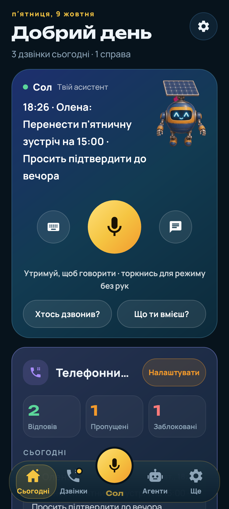

# Solarchik Assistant

English: [README.md](README.md) (там повна версія: архітектура, devnet-докази, що справжнє, а що симуляція).

Я Вадим, роблю Solarchik сам у Solar DePIN. Solarchik Assistant — Android-застосунок, кишеньковий помічник на Solana. Тримаєш одну кнопку й говориш із Солом. AI-секретар відповідає на дзвінки, які ти не можеш узяти, і лишає коротку нотатку. Гаманець агента на Solana devnet робить кроки в мережі лише після твого підтвердження.

**Завантажити:** [solarchik-assistant.apk](https://github.com/Solar-DePIN-Hub/solarchik-assistant/releases/download/v1.0.1/solarchik-assistant.apk) (v1.0.1, Android 8+, sha256 `f771f4c8e08053f8e548522513a9da0bfb7d0b30326680463923ebc8871806ca`)

## Що вміє

- **Сьогодні (головна).** Сол із великим мікрофоном, дзвінки за сьогодні з AI-підсумками, що треба передзвонити, гаманець агента, картка Seeker Season, щоденна відмітка і маленька плитка «Грати».
- **Сол.** Відповідає мовою телефону. Питання на кшталт «хто мені дзвонив?» чи «що робити для сезону Seeker?» він відповідає з телефона, без мережі.
- **Телефонний секретар.** Справжній номер (Zadarma SIP → OpenAI Realtime). Після дзвінка є транскрипт, підсумок, нагадування і блок-лист.
- **Гаманець агента (devnet).** Працює через MWA (Phantom, Solflare, Seed Vault) або вбудований devnet-гаманець. Нічого не підписується без твого дотику.
- **Seeker Season.** План на день:
  - відкрий застосунок;
  - відкрий один запропонований dApp (Orb, Jupiter, Loopscale, TokenRun);
  - підпиши відмітку.

  Пункти відмічаються лише за справжнім станом на телефоні. Баланс SKR читається з mainnet (лише читання), а стейкінг відкривається на [stake.solanamobile.com](https://stake.solanamobile.com). Ніякого автофарму, автопідпису чи вигаданих балів.
- **Гра.** Пробіжка на даху з CLOCK IN лишилась як маленький бонус.

## Чесно

- Усі транзакції йдуть тільки в devnet; ця збірка взагалі не підписує в mainnet.
- Торгівля агентів — паперова: агенти не відправляють ордерів на біржі.
- Скриншоти — справжні екрани з тестів (Robolectric), але дзвінки й баланс у них тестові.
- На емуляторі й на справжньому телефоні цю збірку я ще не перевіряв; голос і секретаря треба пробувати на телефоні.

Контакти: team.solardepinhub@gmail.com · [@SolarDePin](https://x.com/SolarDePin)
