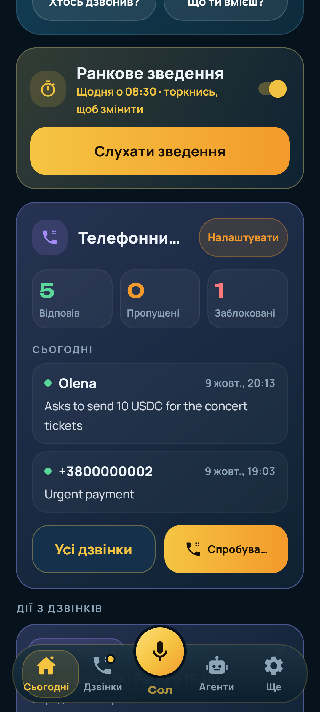
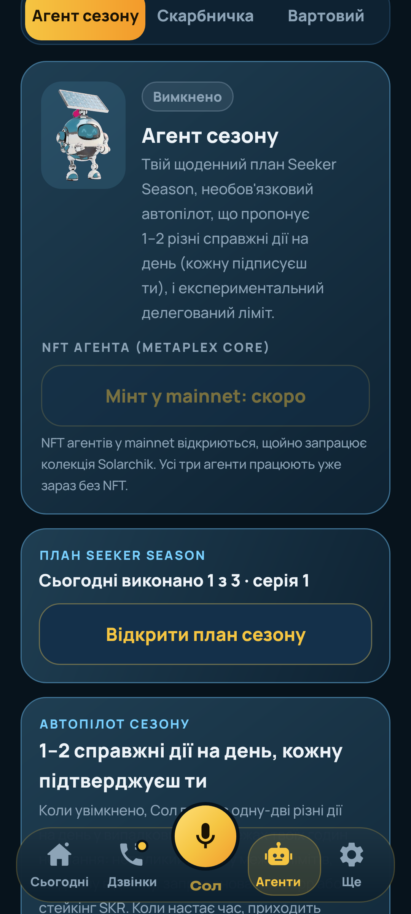
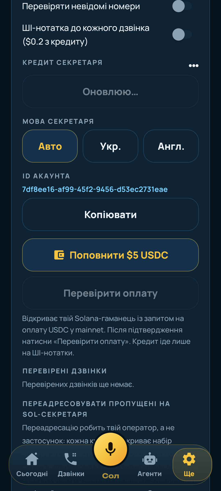

# Solarchik Assistant

English: [README.md](README.md) (там повна версія: архітектура, докази, що справжнє, а що ні).

Я Вадим, роблю Solarchik сам у Solar DePIN. Solarchik Assistant — Android-застосунок, кишеньковий помічник на Solana. Тримаєш одну кнопку й говориш із Солом. AI-секретар відповідає на дзвінки, які ти не можеш узяти, і лишає коротку нотатку. З версії 1.1.0 застосунок працює в **mainnet** з твоїм гаманцем (Mobile Wallet Adapter), і кожну транзакцію ти схвалюєш у гаманці.

**Завантажити:** [solarchik-assistant.apk](https://github.com/Solar-DePIN-Hub/solarchik-assistant/releases/download/v1.2.6.1/solarchik-assistant.apk) (v1.2.6.1, Android 8+, sha256 `355d3340e423b430166b1679438367a0e3f6a6f9464820c110260d063c3c0556`)

**Виправлено в 1.2.6.1 (платежі, справжня причина):** Phantom мовчки відкидає запит `sign_and_send_transactions` без `min_context_slot` (його схема цього поля вимагає, тож він не показує вікна й нічого не відповідає; відома проблема solana-mobile/mobile-wallet-adapter#1146). Наш запит його не мав, і це точно збігається з планшетом: «Підключити», потім головний екран Phantom, потім тайм-аут. Тепер запит містить слот того blockhash, з яким зібрано переказ. Перед відкриттям гаманця застосунок ще й симулює переказ у mainnet, тож платіж, який Solana відхилила б (замало SOL, нова адреса нижче мінімуму ренти, немає USDC), зупиняється з зрозумілою причиною, а не відкриває Phantom. Якщо гаманець усе одно не відповідає на sign-and-send, застосунок у тій самій сесії просить лише підпис і надсилає транзакцію сам через RPC. Вікно статусу тепер рахує секунди очікування. А ще: один рядок на дзвінок у «Нещодавніх», одне «Передзвонити» на номер, англійський чат Сола ховає старі українські повідомлення, хмарка над Солом не обрізає слово, зведення пише «Vadym», а текст Кола коротший.

**Виправлено в 1.2.6 (платежі):** на планшеті «Надіслати» в Колі показувало в Phantom лише запит на підключення, потім Phantom переходив на головний екран, нічого не просив підписати, а застосунок мовчав. Тепер переказ збирається зі свіжим blockhash до відкриття гаманця, тож сесія гаманця лише підтверджує підключення й підпис (одна сесія), а на екрані лишається статус: «Підтвердь у гаманці», далі «Не надіслано» з причиною або «Надіслано» і «Розраховано ✓» з посиланням на Solscan після підтвердження в Solana. Ідентичність застосунку тепер https://app.solardepin.net: там лежить файл Digital Asset Links для цього пакета й сертифіката підпису, тож Phantom може перевірити застосунок замість попередження, що ідентичність не підтверджено (основний сайт на Framer не віддає файли /.well-known).

**Нове в 1.2.6:** **Пересилання пропущених дзвінків Солу** («Ще → Телефонний секретар»). Крок 1 підтверджує номер цього телефону без SMS: тиснеш «Підтвердити» й один раз дзвониш на лінію секретаря з цього телефону; лінія впізнає номер, прив'язує його до твого акаунта й завершує дзвінок без відповіді. Крок 2 відкриває набір номера зі стандартними GSM-кодами (усі умовні `**004*<лінія>#` або окремо: без відповіді `**61`, зайнято `**67`, недоступний `**62`; вимкнути `##004#`); ти тиснеш виклик, і оператор усе вмикає, але може брати плату за переадресацію. Переадресований дзвінок знаходить тебе двома шляхами: якщо оператор передає твій номер разом із дзвінком (заголовки Diversion / History-Info), він збігається з підтвердженим; якщо ні, лінія бере абонента, якого твій телефон щойно перевірив (Solarchik як застосунок перевірки дзвінків надсилає лише хеш номера, він живе 3 хвилини). Дзвінок, який лінія не може зіставити, потрапляє в демо-скриньку власника лінії. Добові ліміти хвилин не змінились. Який із двох шляхів дає твій оператор, ще треба перевірити живим переадресованим дзвінком. **Ранкова стопка** після карток дзвінків продовжується до 3 завдань Season на день з офіційних дописів Solana Mobile: «Відкрити» лише відкриває допис, а після повернення застосунок питає «Готово?»; «Пізніше» і голос теж працюють. Порожня стопка = відмітка зміни. Номери людей поза твоїм Колом на екрані приховані («+380 •• ••• •• 33», вимикач показує їх повністю), а зведення вітається за часом доби.

**Нове в 1.2.5:** **Ранкова стопка**: на «Сьогодні» по одній показуються картки, які лишились після дзвінків (оплатити, передзвонити, нагадати), спершу платежі. Свайп праворуч або кнопка на картці виконує дію (відкриває набір номера, заповнене підтвердження в гаманці або ставить нагадування), свайп ліворуч чи «Пізніше» переносить картку на завтрашній ранок, а «Прочитати вголос» дає відповісти голосом: «готово», «пізніше» чи «оплатити». Коли нічого не лишилось, «Сьогодні» показує, що зміну відмічено, і серію днів. Ця відмітка зберігається на телефоні; підписати CLOCK IN-мемо в Solana можна за бажанням, у гаманці. Сповіщення о 8:00 приходить лише тоді, коли є картки, і вимикається в «Ще → Нагадування». **Перший запуск** показує, як подзвонити секретарю (дзвінок на демо-лінію в один дотик), де з'явиться нотатка, і як підключити Phantom (необов'язково). На **«Сьогодні»** спершу картки, далі гаманець, зведення й Season; гра переїхала в «Ще». Помилки підключення гаманця тепер пояснені простими словами. Поки немає: бонусних хвилин секретаря за 7 днів поспіль, бо серію рахує телефон і сервер ще не може її перевірити.

**Нове в 1.2.4:** **Коло**, список того, кому ти винен, складений з дзвінків (Ще → Коло). Коли абонент просить надіслати гроші («скинь 0.01 SOL за обід»), тут з'являється «Ти винен Іра: 0.01 SOL» з посиланням на дзвінок. «Розрахуватися» надсилає на адресу, яку ти зберіг сам (збіг за телефоном, потім за іменем): одне підтвердження в застосунку і схвалення в гаманці. Коли мережа підтвердить переказ, борг стає розрахованим із посиланням на Solscan, і секретар може сказати Ірі, що гроші вже надіслано. Якщо адреси ще немає, є «Додати гаманець» (ім'я й телефон уже заповнені; встав адресу або посилання solana:) і «Попросити гаманець» (повідомлення через меню «Поділитися»). Сол відповідає на «кому я винен?» і «надішли Ірі борг» за цим списком, а ранкове зведення каже «Ти винен Іра 0.01 SOL після дзвінка учора». Адреса, почута в дзвінку, ніколи не використовується. Також: якщо гаманець не приймає збережений токен, підключення знову просить схвалення; баланс на «Сьогодні» такий самий, як у Налаштуваннях; дублікати карток прибрано; текст карток іншою мовою приховано; лог діагностики коротший. Поки є лише борги «ти винен» (без «тобі винні»), сканування QR ще немає (вставка працює), на пристрої Коло ще не перевірено.

**Нове в 1.2.1** (перевірка всього застосунку): кожен екран відрендерено англійською та українською (жодної кирилиці в англійській; обрізані українські кнопки тепер вміщаються), кожну кнопку перевірено на робочий обробник, рядок «Бонуси партнерів сьогодні» на картці Сезону в «Сьогодні», довгі відповіді Сола діляться, тож голос не обривається на 400 символах, порожня кнопка «Надіслати» ставить курсор у поле, поле номера переадресації більше не витісняє «Зберегти», чесний текст про приватність у вкладці Сола. Воркер: дати блогу беруться з розмітки сторінки, українські нотатки пишуть номер для зворотного дзвінка українською, зведення не зачитує номери телефонів.

**Нове в 1.2.0** (воркер уже працює; функції застосунку нижче ще треба перевірити на пристрої):
- **Гаманець:** Налаштування → Діагностика гаманця записує кожен крок Mobile Wallet Adapter і дає скопіювати чи надіслати журнал; можна явно вибрати Phantom або Solflare; довше чекаємо повільний гаманець; відкритий трафік дозволено лише до 127.0.0.1/localhost (локальний WebSocket MWA). Підключення Phantom на моєму планшеті **ще не підтверджене**.
- **SKR:** дзвінок «скинь мені 50 SKR» стає карткою «Сплатити 50 SKR»; адресу отримувача вводиш сам (з дзвінка не береться), застосунок готує SPL-переказ (створює SKR-рахунок отримувача, якщо його немає; 6 знаків перевірено в mainnet), а підписує твій гаманець. Баланс SKR на «Сьогодні» і в зведенні, посилання «Стейкати SKR» на stake.solanamobile.com (без цифр дохідності), сповіщення Вартового про ціну SKR, і Сол відповідає «скільки в мене SKR».
- **Завдання Сезону:** партнерські бонуси Seeker Season на сьогодні з посиланням на джерело. Читає офіційний блог і документацію Solana Mobile. Підтримка X вбудована й вмикається з платним API. Оголошення з X — це перевірена вручну добірка з датою (10.10.2026). Жодних обіцянок балів.
- **Підтверджений Seeker:** вхід через Sign In With Solana і перевірка Seeker Genesis Token на сервері (Token-2022, ненульовий баланс, метадані й група SGT; один токен = один акаунт) дають бейдж і +10 хв секретаря на день. Без Seeker усе працює так само. На справжньому Seeker не перевірено (у мене його немає); серверну перевірку протестовано на реальних ончейн-даних власника.

> **Mainnet, справжні кошти.** Усе, що ти схвалюєш у гаманці, рухає справжні SOL чи токени, і це не скасувати. Застосунок ніколи не підписує за твій гаманець сам. Справжні обміни, Скарбничка й експериментальний делегований ліміт вимкнені, доки ти їх не ввімкнеш, і мають маленькі ліміти.

| Сьогодні | Агенти | Налаштування |
| --- | --- | --- |
|  |  |  |

## Що вміє

Мова: типово англійська; українську вмикаєш у «Ще» → «Мова» (там же «Як у телефоні»). Обидві мови повні.

- **Сьогодні (головна).** Сол із великим мікрофоном, ранкове зведення, картки дій із дзвінків, дзвінки за сьогодні з AI-підсумками, нагадування, гаманець у mainnet, картка Seeker Season і щоденна відмітка.
- **Ранкове голосове зведення.** О вибраний час (типово 08:30) приходить сповіщення. Торкнися його або просто відкрий «Сьогодні», і Сол голосом розкаже: хто дзвонив і чого хотів, кому передзвонити, що на сьогодні, як змінився гаманець з учора і що з планом сезону. Є й кнопка, щоб прослухати його будь-коли.
- **Дії з дзвінків.** Із нотатки дзвінка worker знаходить прохання: оплату, передзвонити чи нагадати. Один дзвінок дає до трьох карток, а «нагадай їй про зустріч у понеділок» стає нагадуванням на цей понеділок (о 09:00, якщо час не назвали). Один AI-дзвінок триває до 3 хвилин: о 2:45 секретар каже, що передасть повідомлення, і прощається, о 3:00 лінія кладе слухавку. За день лінія відповідає щонайбільше 30 AI-хвилин загалом (20 на акаунт), далі абонент чує коротке «зателефонуйте завтра», і нічого не списується.
  - Передзвонити — одним дотиком відкривається набір номера (дзвониш ти сам), можна поставити нагадування.
  - Нагадування — локальне сповіщення.
  - Оплата — підготовлений переказ SOL або USDC, який ти схвалюєш у гаманці. Поле отримувача порожнє. Якщо абонент назвав адресу, вона показана повністю в червоній картці з попередженням про шахраїв; щоб її взяти, треба натиснути «Використати цю адресу» і поставити галочку. Нічого не підписується автоматично.
- **Три агенти** (усі вимкнені за замовчуванням):
  - **Агент сезону** — план Seeker Season, автопілот (1–2 справжні дії на день сповіщеннями: ти торкаєшся, гаманець підписує) і експериментальний делегований ліміт. Він стежить за офіційними правилами: кожні 6 годин (і за кнопкою «Перевірити оновлення правил») читає блог і документацію Solana Mobile, бере лише те, що там написано дослівно, з посиланням на джерело. Сам змінює план лише безпечно (порядок підказок, менше дій), а все, що означає більші витрати, чекає на твою згоду. X не читаємо.
  - **Скарбничка** — потроху переводить SOL в USDC чи SKR за розкладом або часткою «решти» після твого обміну. Кожне збереження — справжній обмін Jupiter через звичайний перегляд і твій гаманець.
  - **Вартовий** — стежить за цінами SOL/SKR/JUP і балансом гаманця, пише, коли щось рухається. Ніколи не торгує.
- **NFT агентів.** Free і Pro (0.1 SOL) для кожного з трьох агентів; у mainnet — «скоро». Агенти працюють і без NFT.
- **Seeker Season.** Пункти відмічаються лише за справжніми діями. Баланс SKR читається з mainnet, стейкінг — на [stake.solanamobile.com](https://stake.solanamobile.com). Ніякого автофарму й обіцянок балів: застосунок не може дати тобі бали.

## Чесно

- Це mainnet і справжні гроші. Почни з дуже малих сум. Збірку зробила одна людина для хакатону, аудиту не було.
- Підписані транзакції в mainnet (обмін, відмітка, approve/revoke, делегований обмін, оплата з дзвінка) я перевіряв збиранням і симуляцією в mainnet, без справжніх коштів.
- Делеговані дії можуть не зарахуватися в Seeker Season.
- Фонові агенти й брифінг працюють через WorkManager: час може зсуватися на 15 хв і більше.
- Скриншоти — справжні екрани з тестів (Robolectric) і з Firebase Test Lab; дзвінки й баланс у них тестові.

Контакти: team.solardepinhub@gmail.com · [@SolarDePin](https://x.com/SolarDePin)

## Ліцензія

MIT, див. [LICENSE](LICENSE).
